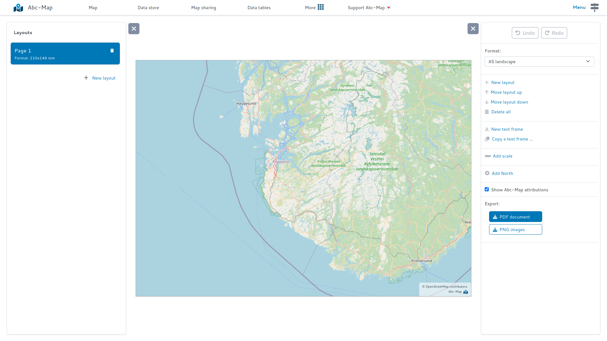

## Presentation

Now the Abc-Map attribution is optional on exports 🥳

You can now hide the "Abc-Map" logo at the bottom of exports, using the "Show Abc-Map attributions" checkbox.

<figure class="figure">
    
    <figcaption>The Abc-Map attributions checkbox</figcaption>
</figure>

## But what is the Abc-Map attribution for?

The Abc-Map attribution makes the software known. By displaying this attribution, you participate in the dissemination of the project, and its maintenance.

**If you can, keep the attributions, it will help keep this project alive !**
