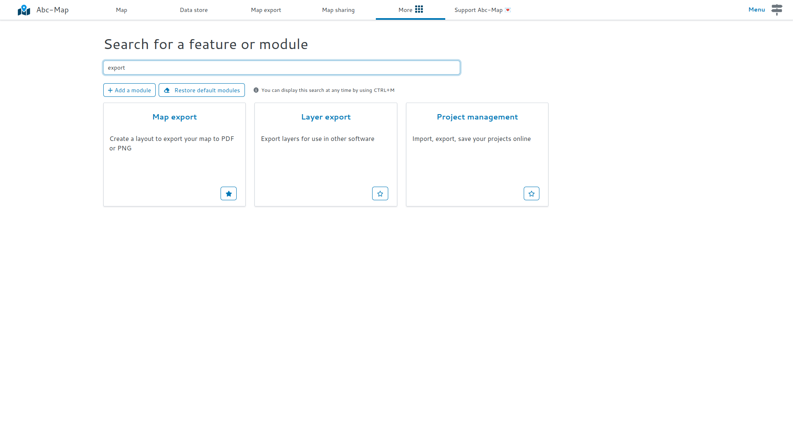
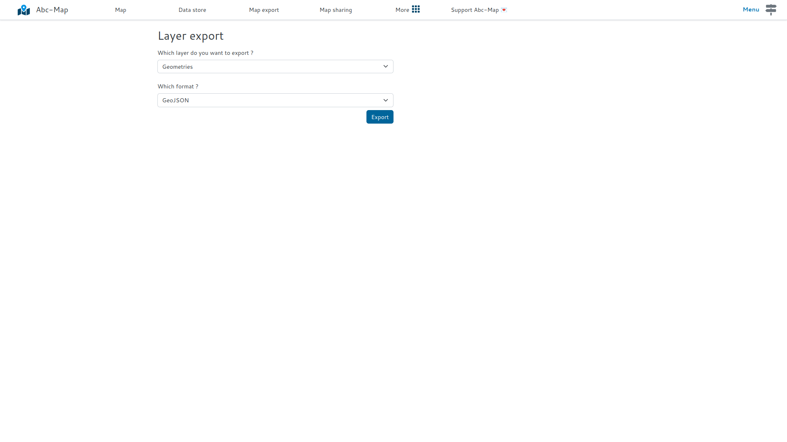

## Introduction

You can now export geometry layers in GeoJSON GPX, KML or GeoJSON format. That
allows you to import data created with Abc-Map into other software.

## How to do ?

- Open the **Layer Export** module
- Select the layer you want to export
- Then select the export format: GeoJSON, GPX, KML, or WKT.
- Finally click on **Export**!

<figure class="figure">
    
    <figcaption>Search for 'Layer export'</figcaption>
</figure>

<figure class="figure">
    
    <figcaption>Then export !</figcaption>
</figure>
