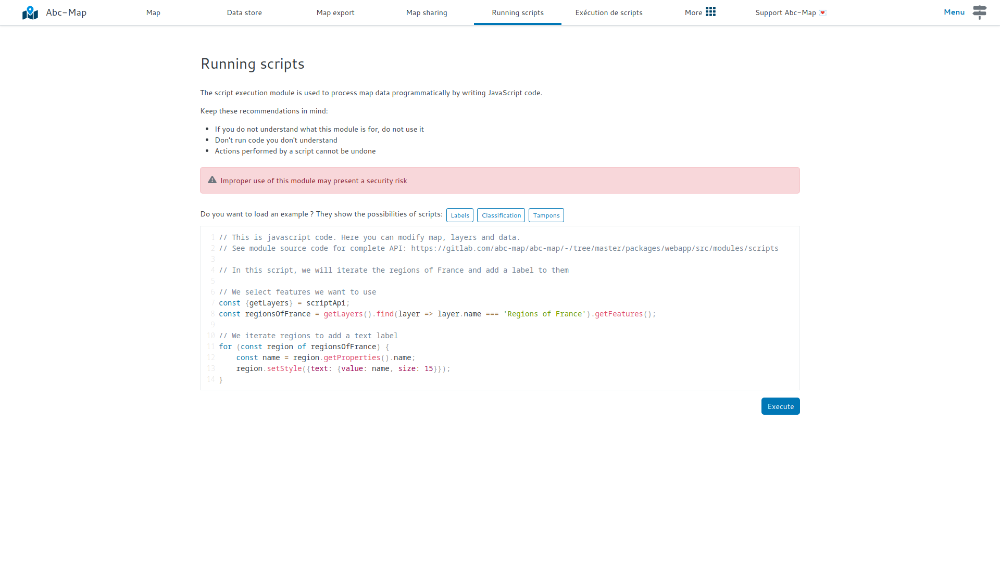

## Introduction

The script execution module has been improved !

If you have basic programming skills, you can edit your maps using Javascript code.
This method is very powerful ! You can implement many thematic mapping or spatial analysis algorithms.

## How to use it ?

- Open the **Running scripts** module
- Load an example: `Labels`, `Classification` or `Stamps`.
  - `Labels` is the most basic example, it shows how to modify the style of a layer's geometries.
  - `Classification` shows how to change the style of a geometry based on its attributes.
  - Finally `Buffers` shows how to load an external library (here [Turf](https://turfjs.org/)) to modify a geometry.
- Click `Run` then observe the results on the `Map` page.
- Adapt the example that comes closest to your needs

<figure class="figure">
    
    <figcaption>'Running scripts' module</figcaption>
</figure>

## Advice

- Use a code editor for your algorithms, for example VS Code
- Test your code regularly, after each change
