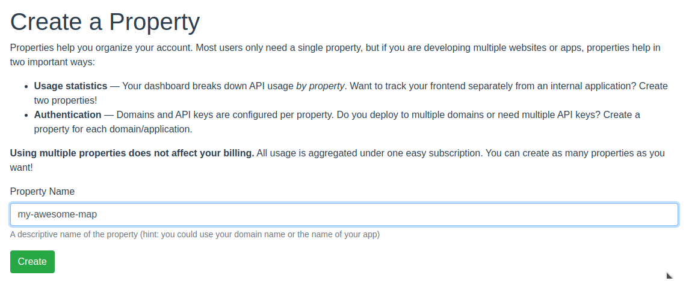
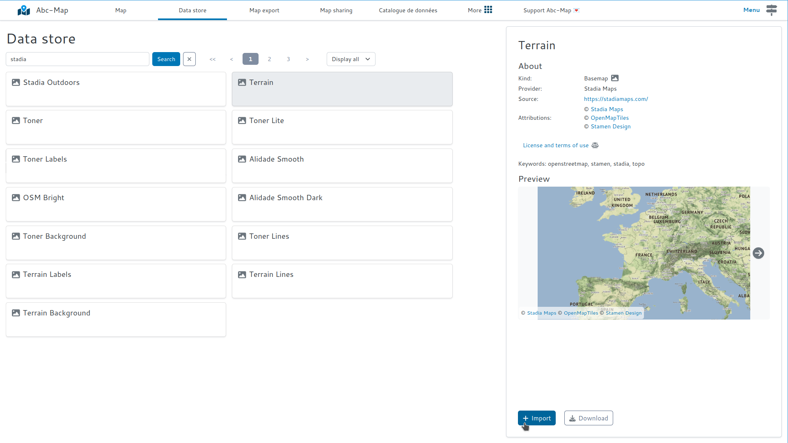
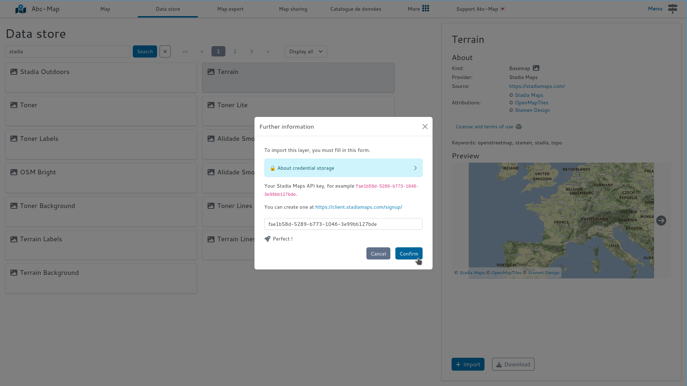

## Introduction

[Stadia Maps](https://stadiamaps.com/) offers beautiful base maps available at attractive prices. There is also a free third party that allows
great experiments without spending anything.

Since October 2023, Stadia Maps is the new provider of [Stamen](https://maps.stamen.com/stadia-partnership/) tiles.

This post describes how to use Stadia Maps basemaps with Abc-Map as XYZ layers.

## How to use Stadia Maps layers ?

### Step 1: Sign up for Stadia Maps

Register here: [https://stadiamaps.com/stamen/onboarding/create-account/](https://stadiamaps.com/stamen/onboarding/create-account/)

You don't need to fill in any payment information to get started.

### Step 2: Create an API key

    
What is an API key?

    
An API key is a code that authenticates you to a service. API keys must be kept secret.

    If you use an API key in a <i>public project</i>, this may result in <b>excessive billing</b>.

Create a "property".

<figure class="figure">
    
    <figcaption>Property creation form</figcaption>
</figure>

In the 'Authentication Configuration' section create an API key:

<figure class="figure">
    
    <figcaption>Button for creating an API key</figcaption>
</figure>

Keep the tab open, you will need your key in the next step.

<figure class="figure">
    
    <figcaption>API key example</figcaption>
</figure>

### Step 3: choose and add a basemap

The easiest is to use the data store. Open the data store and select a layer:

<figure class="figure">
    
    <figcaption>Selecting a layer from the data store</figcaption>
</figure>

Then enter your API key:

<figure class="figure">
    
    <figcaption>Entering the API key</figcaption>
</figure>

_Et voilà !_
