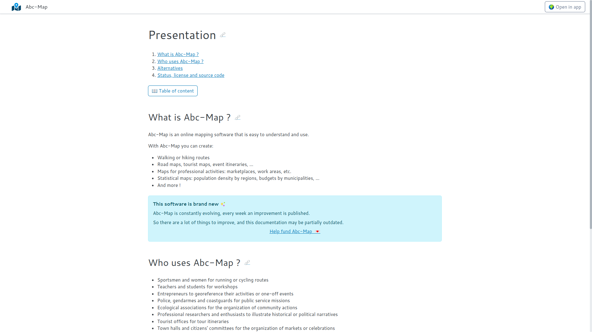

## Nouveau moteur de documentation

Un nouveau moteur de documentation a été mis en place, c'est [Eleventy](https://www.11ty.dev/). C'est un
très bon logiciel qui permet de créer des sites statiques.

Ce nouveau moteur permettra d'avoir une plus grande documentation, plus facile à utiliser et plus facile
à découvrir via les moteurs de recherche.

<figure  class="figure">
    
    <figcaption>Une capture d'écran de la nouvelle documentation statique autonome</figcaption>
</figure>

Pour accéder à la documentation directement dans l'application, utilisez cette url: [https://abc-map.fr/fr/modules/documentation](/fr/modules/documentation)

Pour accéder à la documentation statique autonome, utilisez cette url: [https://abc-map.fr/documentation/fr](/documentation/fr)

## A suivre

Une mise à jour de la documentation (son contenu).
