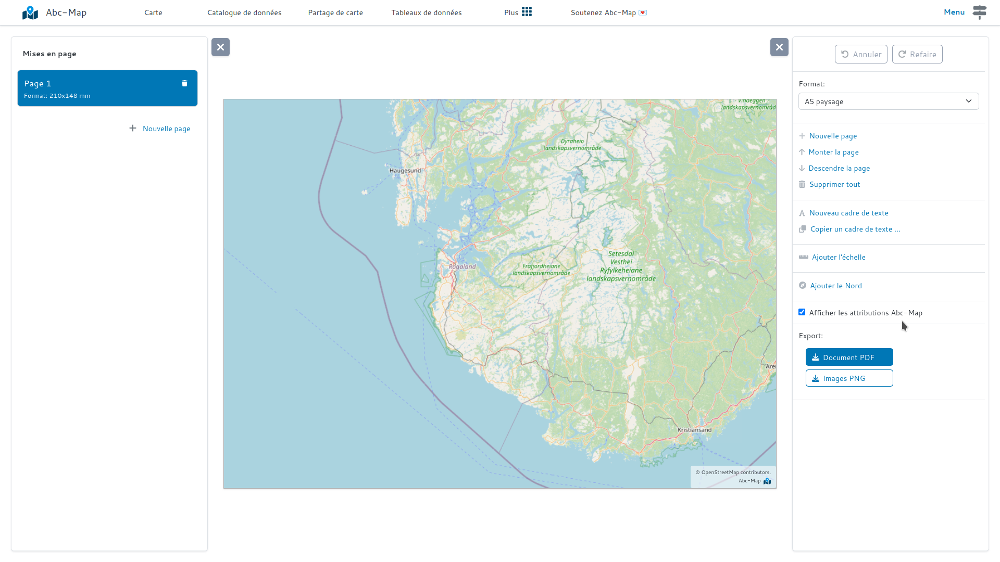

## Présentation

Désormais l'attribution Abc-Map est optionnelle sur les exports 🥳

Vous pouvez désormais masquer le logo "Abc-Map" en bas des exports, en utilisant la case à cocher "Afficher les attributions Abc-Map".

<figure class="figure">
    
    <figcaption>La case à cocher des attributions Abc-Map</figcaption>
</figure>

## Mais à quoi sert l'attribution Abc-Map ?

L'attribution Abc-Map permet de faire connaitre le logiciel. En affichant cette attribution, vous participez à
la diffusion du projet, et à son maintien.

**Si vous le pouvez, conservez les attributions, cela aidera à faire vivre ce projet !**
