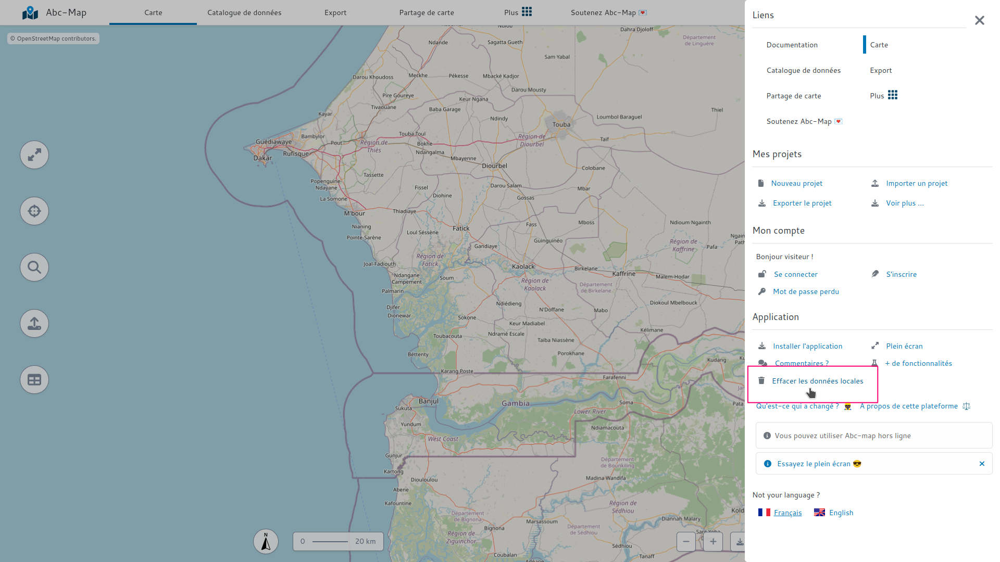

## Introduction

Vous venez de démarrer Abc-Map, mais ça ne fonctionne comme vous le voulez ?

S'il s'agit d'un bug, ce guide peut vous aider à le résoudre.

## Rechargez l'application

Recharger l'application peut résoudre votre bug, par exemple en appliquant une mise à jour.

Pour recharger l'application, fermez toutes les instances de l'application: onglets ou fenêtres de bureau.

Ensuite, redémarrez l'application.

## Effacer les données locales

Si recharger l'application n'a pas suffi, vous pouvez effacer les données locales.

Pour effacer les données locales, ouvrez le menu et cliquez sur "Effacer les données de l'application".

<figure class="figure">
    
    <figcaption>Le bouton 'Effacer les données'</figcaption>
</figure>
