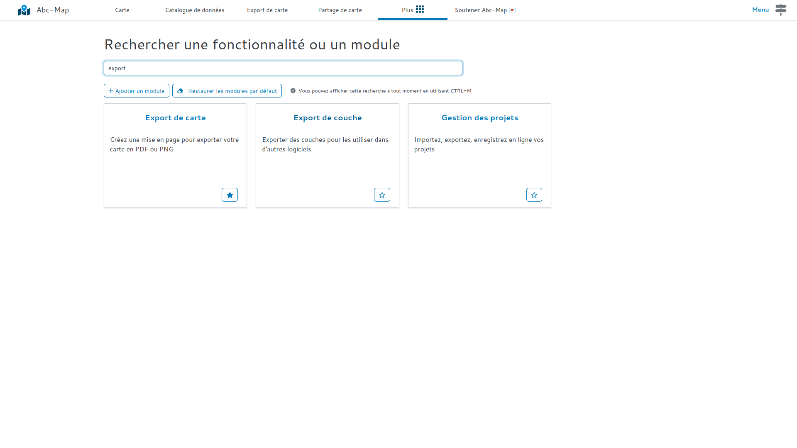
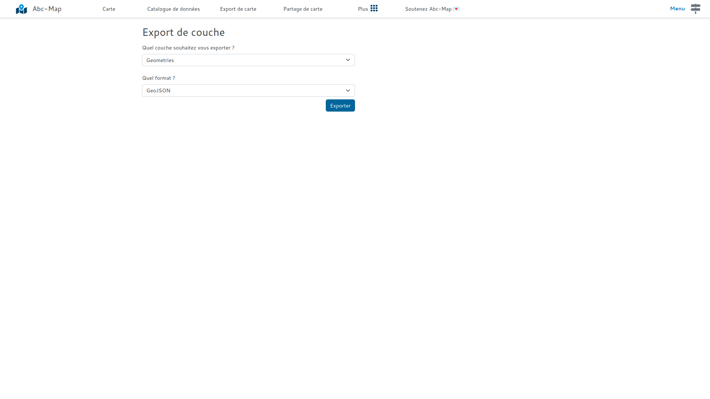

## Introduction

Vous pouvez désormais exporter les couches de géométries au format GeoJSON GPX, KML ou GeoJSON. Cela
permet d'importer des données créées avec Abc-Map dans d'autres logiciels.

## Comment faire ?

- Ouvrez le module **Export de couche**
- Sélectionnez la couche que vous souhaitez exporter
- Puis sélectionnez le format d'export: GeoJSON, GPX, KML, ou WKT.
- Enfin cliquez sur **Exporter** !

<figure class="figure">
    
    <figcaption>Recherchez 'Export de couche'</figcaption>
</figure>

<figure class="figure">
    
    <figcaption>Puis exportez !</figcaption>
</figure>
