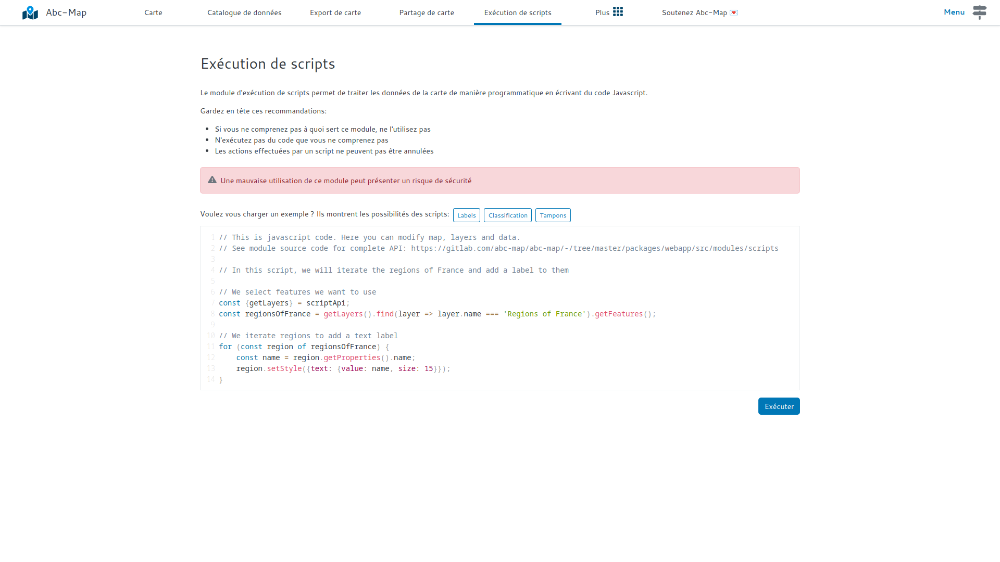

## Introduction

Le module d'exécution de scripts a été amélioré !

Si vous avez des compétences basiques en programmation, vous pouvez modifier vos cartes en utilisant du code Javascript.
Cette méthode est très puissante ! Vous pouvez mettre en œuvre de nombreux algorithmes de cartographie thématique ou d’analyse spatiale.

## Comment l'utiliser ?

- Ouvrez le module **Exécution de scripts**
- Chargez un exemple: `Labels`, `Classification` ou `Tampons`.
  - `Labels` est l'exemple le plus basique, il montre comment modifier le style des géométries d'une couche.
  - `Classification` montre comment changer le style d'une géométrie en fonction de ses attributs.
  - Enfin `Tampons` montre comment charger une librairie externe (ici [Turf](https://turfjs.org/)) pour modifier une géométrie.
- Cliquez sur `Exécuter` puis observez les résultats sur la page `Carte`.
- Adaptez l'exemple qui s'approche le plus de vos besoins

<figure class="figure">
    
    <figcaption>Le module d'exécution de scripts</figcaption>
</figure>

## Conseils

- Utilisez un éditeur de code pour vos algorithmes, par exemple VS Code
- Essayez votre code régulièrement, après chaque modification
