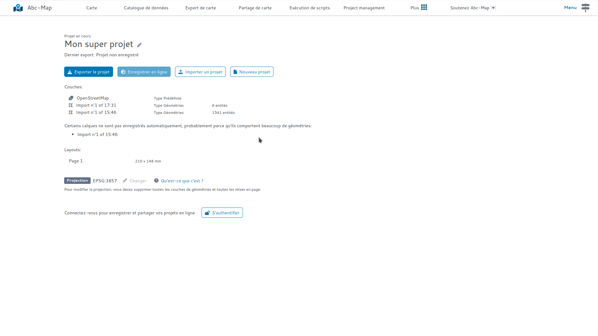

## Introduction

Lorsque vous utilisez Abc-Map, votre projet courant est enregistré automatiquement dans la mémoire de votre
station de travail.

## Comment ça marche ?

Chaque modification de votre projet (ajout d'une couche, modification d'une géométrie, ...) entraine une sauvegarde en arrière-plan. Lorsque vous
démarrez Abc-Map, si un projet est enregistré localement alors ce projet est chargé. Vous pouvez ainsi reprendre votre travail.

Cependant, les couches qui contiennent beaucoup de géométries ne sont pas sauvegardées automatiquement dans le but de préserver
les ressources de votre station de travail.

## Comment savoir si l'enregistrement automatique est activé ?

- Ouvrez le module **Gestion des projets**
- Observez la liste des couches, un message vous indique peut-être que l'enregistrement automatique est désactivé. Si vous ne voyez
  pas de message alors l'enregistrement automatique est activé.

<figure class="figure">
    
    <figcaption>Si l'enregistrement automatique est désactivé pour certaines couches, un message est affiché sur le module de gestion des projets.</figcaption>
</figure>

## Conseils

Pensez à vous déconnecter lorsque vous utilisez un poste de travail partagé !
