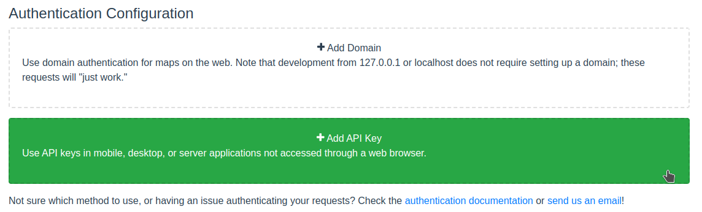
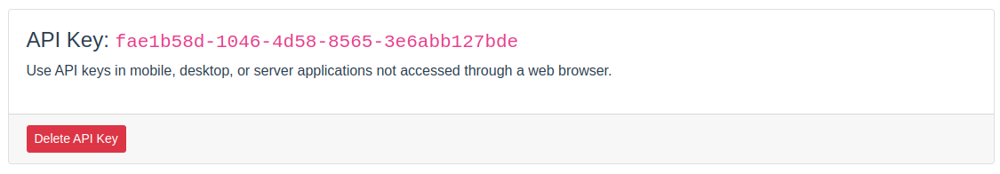
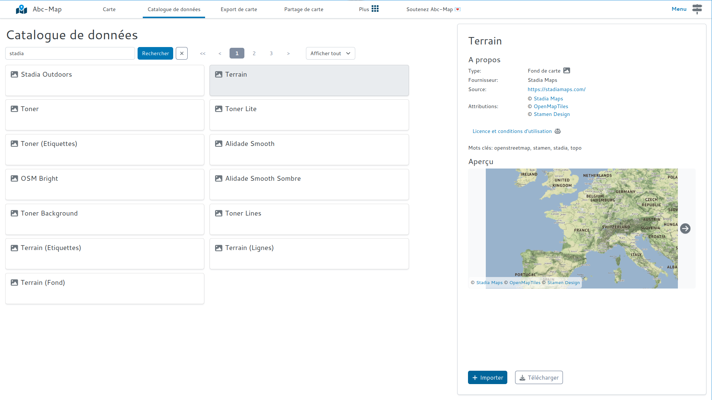
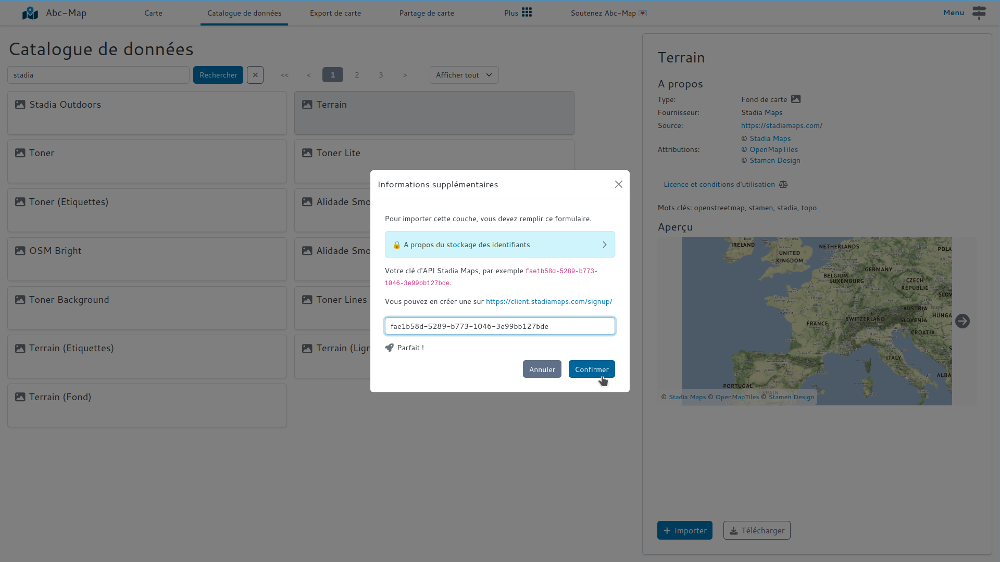

## Introduction

[Stadia Maps](https://stadiamaps.com/) propose de magnifiques fonds de cartes disponibles à des prix attractifs. Il y a aussi un tiers gratuit qui permet
de belles expérimentations sans rien dépenser.

Depuis Octobre 2023, Stadia Maps est le nouveau fournisseur des tuiles [Stamen](https://maps.stamen.com/stadia-partnership/).

Ce billet décrit comment utiliser des fonds de cartes Stadia Maps avec Abc-Map en tant que couches XYZ.

## Comment utiliser les fonds de carte Stadia Maps ?

### Etape 1: s'inscrire sur Stadia Maps

Inscrivez-vous ici: [https://stadiamaps.com/stamen/onboarding/create-account/](https://stadiamaps.com/stamen/onboarding/create-account/)

Vous n'avez pas besoin de renseigner des informations de paiement pour commencer.

### Etape 2: créer une clé d'API

    
Qu'est ce qu'une clé d'API ?

    
Une clé d'API est un code qui vous authentifie auprès d'un service. Les clés d'API doivent être gardées secrètes.

    Si vous utilisez une clé d'API dans un <i>projet public</i>, cela peut entrainer une <b>facturation excessive</b>. 

Créez une "propriété".

<figure class="figure">
    
    <figcaption>Formulaire de création d'une propriété</figcaption>
</figure>

Dans la section 'Authentication Configuration' créez une clé d'API:

<figure class="figure">
    
    <figcaption>Bouton de création d'une clé d'API</figcaption>
</figure>

Gardez l'onglet ouvert, vous aurez besoin de votre clé dans la prochaine étape.

<figure class="figure">
    
    <figcaption>Exemple de clé d'API</figcaption>
</figure>

### Etape 3: choisir et ajouter un fond de carte

Le plus facile est d'utiliser le magasin de données. Ouvrez le magasin de données et sélectionnez une couche:

<figure class="figure">
    
    <figcaption>Sélection d'une couche dans le magasin de données</figcaption>
</figure>

Saisissez ensuite votre clé d'API:

<figure class="figure">
    
    <figcaption>Saisie de la clé d'API</figcaption>
</figure>

Et voilà !
