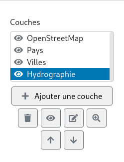

# Les couches

Les cartes sont composées de couches. Les couches contiennent les données d'une carte et permettent de les organiser.
Chaque couche est dessinée sur la carte dans l'ordre de la liste. La première couche est dessinée sur la carte en
premier, la deuxième en deuxième, ...

Il y a deux types de couches dans Abc-Map: les fonds de cartes et les couches de géométries.

**Les fonds de carte ou couches raster**  
Ces couches contiennent des images. Elles ne peuvent pas être modifiées avec les outils de dessin. Vous pouvez utiliser
ces couches:

- Les couches prédéfinies: des couches pré-configurées pour être utilisées facilement
- Les couches <a href="https://fr.wikipedia.org/wiki/Web_Map_Service" target="_blank">WMS</a>
- Les couches <a href="https://developers.planet.com/planetschool/xyz-tiles-and-slippy-maps/">XYZ</a>

**Les couches de géométries ou couches vectorielles**  
Ces couches contiennent des géométries et peuvent être modifiées avec les outils de dessin.
Vous pouvez:

- Créer des couches vides à l'aide du contrôle de couche
- Créer des couches à partir du catalogue de données ou de fichiers de données (GPX, KML, shapefiles, ...)

<figure class="my-3">
    
    <figcaption>Contrôle de couches</figcaption>
</figure>
 
Le contrôle des couches affiche les couches courantes de la carte et permet:
- D'ajouter une couche
- De supprimer une couche
- De changer la visibilité d'une couche
- De renommer une couche
- De zoomer sur une couche
- De changer l'ordre des couches
- De sélectionner une couche *active*
