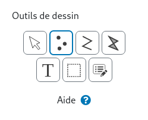

# Outils de dessin

Les outils de dessin permettent de créer ou de modifier des formes. Les outils de dessin ne fonctionnent
que sur une couche de géométries active, ils sont désactivés si vous sélectionnez une couche fond de carte.

Chaque outil propose une aide spécifique pour expliquer son fonctionnement.

<figure>
    
    <figcaption>Sélecteur d'outil de dessin et  bouton aide de l'outil</figcaption>
</figure>

De droite à gauche et de haut en bas il y a:

- L'outil Point
- L'outil Ligne
- L'outil Polygone
- L'outil Texte
- L'outil Sélection
- L'outil Propriétés

Vous pouvez cliquer sur le bouton "Aide" de chaque outil pour connaitre son fonctionnement détaillé.

## Outil Point

L'outil Point permet de créer et de modifier des points. Vous pouvez sélectionner une icone, une taille et une couleur.

## Outil Ligne

L'outil Ligne permet de créer et de modifier des lignes. Vous pouvez sélectionner une taille et une couleur de trait.

## Outil Polygone

L'outil Polygone permet de créer et de modifier des polygones. Vous pouvez sélectionner une taille et une couleur de trait, une couleur de fond et une texture.

## Outil Texte

L'outil Texte permet d'ajouter et de modifier du texte attaché à des formes existantes.

## Outil Propriétés

L'outil Propriétés permet de créer et de modifier des propriétés à des formes existante.
