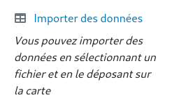

# Importer des données

Vous pouvez importer des données sur vos cartes de plusieurs manières:

- En utilisant le `Catalogue de données`, qui fournit des données courantes
- En utilisant vos propres données, en déposant vos données sur `la page Carte`
- En utilisant vos propres données, en utilisant le contrôle d'import de données

<figure>
    
    <figcaption>Controle d'import de données</figcaption>
</figure>

Vous pouvez importer:

- des fichiers GPX
- des fichiers KML
- des fichiers GeoJSON
- des fichiers Shapefile

Les fichiers sont systématiquement importés dans de nouvelles couches, avec le style par défaut.

## Sources externes

Si vous ne trouvez pas ce que vous voulez, pensez à visiter:

- <a href="http://www.naturalearthdata.com" target="_blank">naturalearthdata.com</a>
- <a href="https://gadm.org" target="_blank">gadm.org</a>
- <a href="https://www.diva-gis.org" target="_blank">diva-gis.org</a>
- <a href="https://data.humdata.org" target="_blank">data.humdata.org</a>
- <a href="https://public.opendatasoft.com/explore" target="_blank">opendatasoft.com</a>
