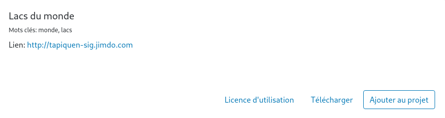

# Catalogue de données

La page `Catalogue de données` propose des données courantes et testées sur le logiciel.

Les données sont proposées sous forme d'`artéfact`, c’est-à-dire en paquet utilisable en tant que couche sur une carte.

<figure>
    
    <figcaption>Exemple d'artéfact du catalogue de données</figcaption>
</figure>

Recherchez l'artéfact qui vous intéresse, cliquez ensuite sur:

- `Ajouter au projet` pour télécharger l'artéfact et l'ajouter au projet en tant que couche.
- `Télécharger` pour télécharger une copie de l'artéfact que vous pourrez modifier avant import.
- `Licence d'utilisation` pour afficher la licence de l'artéfact. Tous les artéfacts du catalogue doivent être libres de droits.
