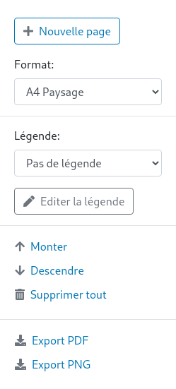

# Mise en page et légende

Sur la page `Mise en page` vous pouvez mettre en page et exporter vos cartes au format `PDF` ou `PNG`.

<figure>
    
    <figcaption>Controles de mise en page</figcaption>
</figure>

Pour cela, créez des `feuilles de mise en page`, positionnez la carte tel que vous le souhaitez et cliquez sur `Export PDF` ou `Export PNG`.

Vous pouvez également créer une légende. Cliquez sur `Editer la légende` puis ajouter des éléments de légende.
Chaque élément peut contenir:

- du texte
- un symbole
